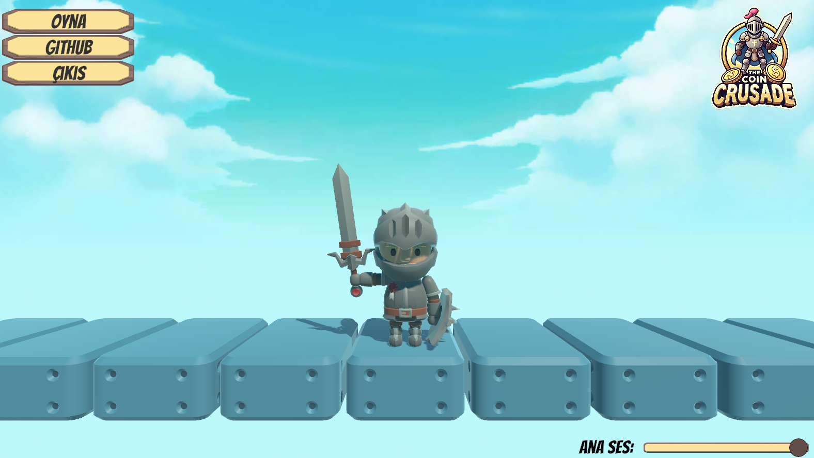
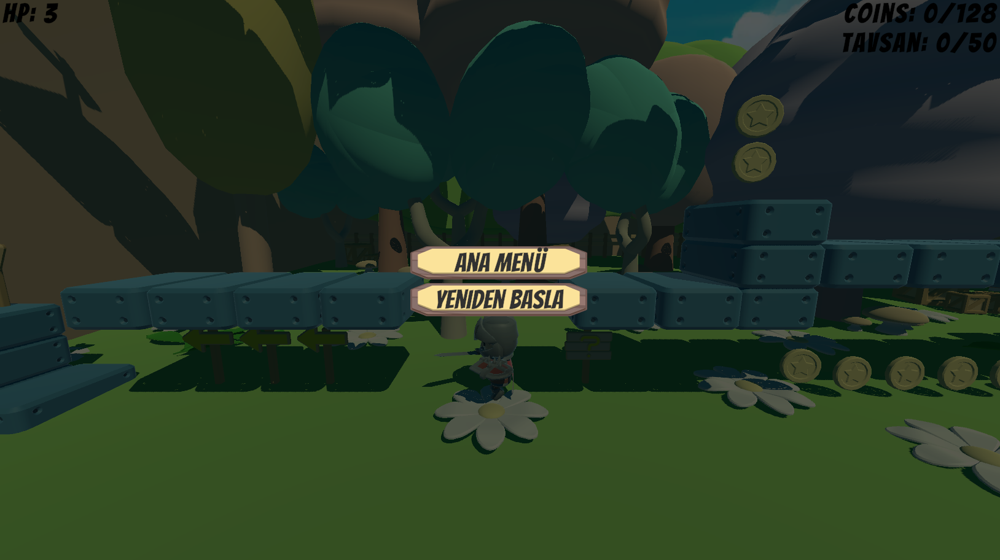
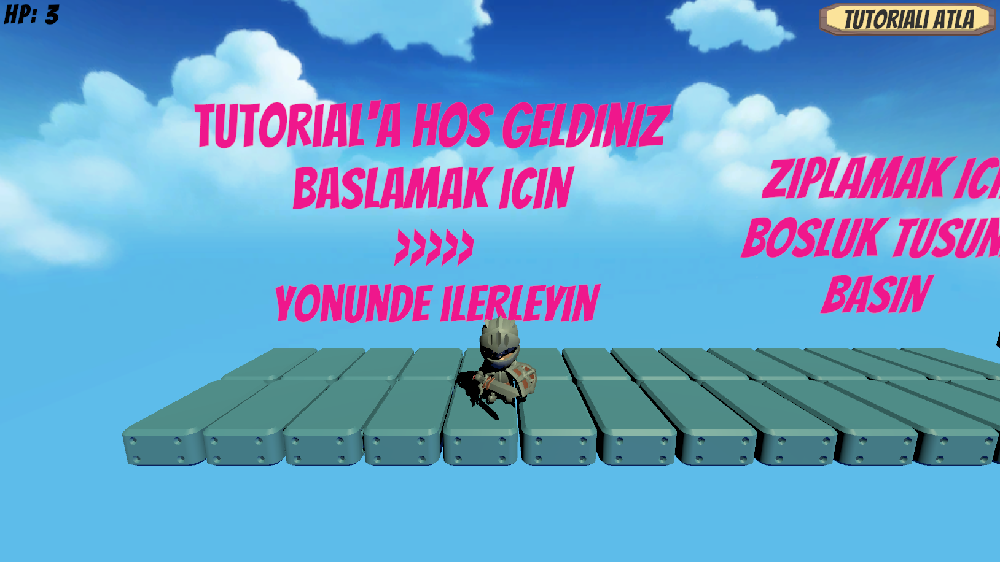

# The Coin Crusade
Oyun Programlama Dersi Final Ödevimiz

## Oyun Bağlantısı
 -  https://erenkose75.itch.io/the-coin-crusade
   
## Görev Paylaşım Tablosu
| #      | Eren KÖSE - 22360859075                 | Eren GÜRELİ - 22360859016                 | Mustafa AYKUT - 22360859028                 |
|--------|-----------------------------------------|-------------------------------------------|---------------------------------------------|
| 1      | Ana Menü (10x)                          | Ana Menü (10x)                            | Ana Menü (10x)                              |
| 2      | Duraklama Menüsü (10x)                  |                                           | Duraklama Menüsü (10x)                      |
| 3      | Animasyonlar (10x)                      | Animasyonlar (10x)                        | Animasyonlar (10x)                          |
| 4      |                                         | Asenkronizasyon (10x)                     |                                             |
| 5      | Ses ve Müzik (10x)                      |  Ses ve Müzik (10x)                       | Ses ve Müzik (10x)                          |
| Toplam | (40x)                                   |  (40x)                                    | (40x)                                       |

## Yapılan Eklemeler

### Ana Menü
- Oyun açıldığında bizi karşılayan ekrandır. Bu ekranın sol üst köşesinde oyunun ilk bölümüne geçen, (yani oyunu başlatan) bir buton, oyunun kaynak kodlarının bulunduğu Github sayfamıza giden bir buton, ve oyundan çıkılmasını sağlayan bir buton bulunmaktadır. Ekranın sağ üst köşesinde ise oyunun logosu, sağ alt köşesinde ise oyunun ana sesinin (master volume) düzenlenmesini sağlayan bir slider bulunmaktadır.

### Duraklama Menüsü
- Oynanış sahnelerinde Input.GetAxis(“Escape”) fonksiyonu ile girdi (input) tespit edilir ve bizi bu menü karşılar. Oyunu olduğu yerde dondurur. Tekrar ESC tuşuna basılınca oyun akmaya devam eder. Bu ekranda iken oyun hafif karaltılmış şekilde görülmeye devam eder. Ekranın tam ortasında bulunan Ana Menü tuşuna basılarak ana menüye geri dönülebilir.

### Animasyonlar
- Oyunumuzdaki Player nesnemizde animasyonlar bulunmaktadır. Bulunan animasyonlar şu şekildedir; 
  - Koşma animasyonu
  - Zıplamaya başlama animasyonu
  - Zıplama sonrasında havada durma animasyonu
  - Zıplama sonrasında yere düşme animasyonu
  - Saldırı animasyonu
  - Idle (boşta durma) animasyonu
  - Hasar alma animasyonu
- Animasyonları kontrol etmek için “Animation Controller” kullanılmıştır.
- Animasyonlu karakterimiz duruma (state) göre animasyonlar arasında geçiş yapmaktadır.
- Devam ediyor olan animasyonlar döngü halinde oynamaktadır ve durum (state) değişimi gerçekleştiğinde eski animasyonun bitmesi beklenmeden sıradaki durumun animasyonuna geçiş hemen başlamaktadır.

### Asenkronizasyon
- Oyunumuza farklı bir sahne daha eklendi. Bu sahne oyunun tanıtımı tarzı bir sahnedir. Bu sahnede neler yapılması gerektiği öğrenilip kontroller denendikten sonra lolipopa dokunulması sonucunda sonraki sahneye geçilebilir. Oyunumuzda sahneler arası geçişler, arayüzde ve oynanışta takılmalara sebep olmayacak şekilde ayarlanmıştır, sahneler asenkron bir şekilde yüklenmektedir.

### Ses ve Müzik
- Zıplama mantarında zıplanması halinde mantardan ses çıkar. Bu ses oyuncunun konumuna göre sağdan veya soldan duyulabilmektedir.
- 50 coin toplanması sonucunda çift zıplamayı aktifleştiren tavşan zıplamaya başlar. Bu süreçte zıplarken ses de çıkarır. Bu sesi oyuncu sağdan veya soldan duyabilmektedir. Bu sayede oyuncu tavşanın nerede olduğunu duyabilir.
- Etrafta kırmızı şekerler bulunmaktadır. Bu şekerlerin alınması sonucunda evren hızlanır. Karakterimiz hızlı hareket etmeye başlar. Aynı zamanda oyunu kazanma noktamız olan lolipoptan bir ses çıkmaya başlar. Bu sesi oyuncu sağdan veya soldan duyabilmektedir. Bu sayede lolipopun konumunu oyuncu anlayabilir.
- Her coin toplanmasında coinlerden ses çıkmaktadır.

## Referanslar
- Zıplama Mantarı Ses Asseti: https://pixabay.com/tr/sound-effects/funny-spring-229170/
- Tavşan Zıplama Ses Asseti: https://poppop.ai/sound-effects/jump-sound (Linkteki ilk ses)
- Lolipop (Bitiş Noktası) Parlama Ses Asseti: https://pixabay.com/sound-effects/fx-light-90387/
- Arka Plan Ses Asseti: https://github.com/erennkose/oyun-programlama-final
